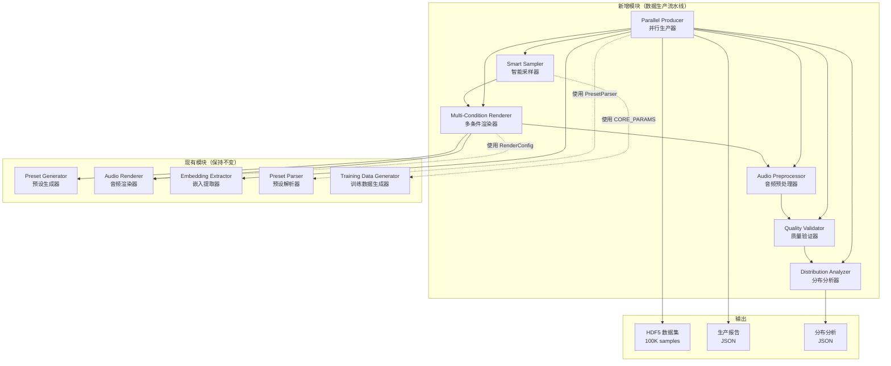
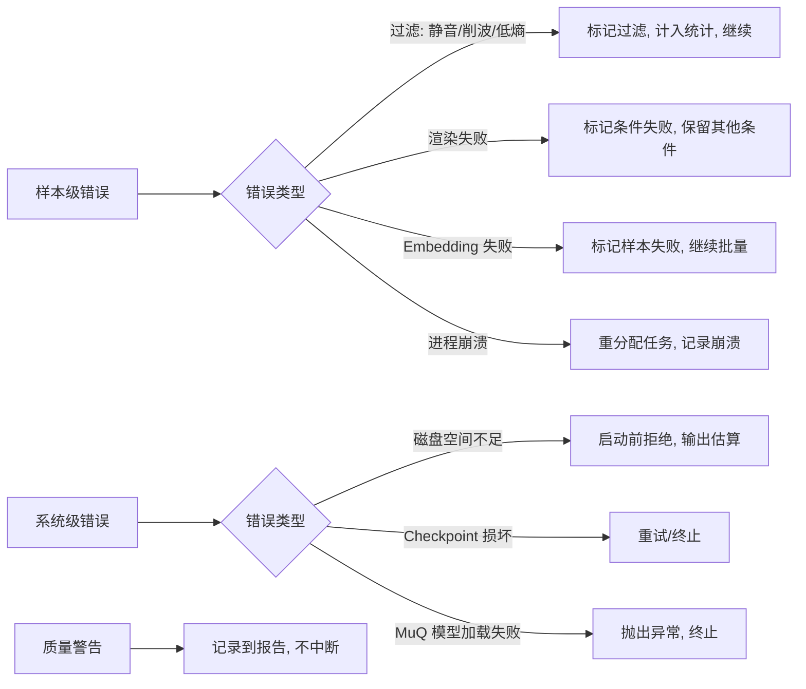

# 设计文档：实验数据生产与预处理流水线

## 概述

本设计扩展现有 `synth-parameter-estimation` 系统，构建一套完整的数据生产流水线，将当前朴素的 10K 均匀采样升级为 100K 级高质量数据集生产能力。核心改进包括：

- **音频预处理**：静音检测、削波检测、DC 偏移消除、峰值归一化、重采样、尾部裁剪
- **智能采样**：拉丁超立方采样（LHS）替代均匀随机，分层采样覆盖效果器开关组合
- **多条件渲染**：3 音高 × 2 力度 = 6 条件/预设，增加数据多样性
- **质量验证**：频谱熵检测、PCA 坍缩检测、近重复样本检测
- **并行生产**：多进程渲染 + GPU 批量 embedding 提取 + 断点续传
- **分布分析**：embedding PCA、cosine similarity 分布、参数覆盖率 KS 检验

### 设计决策

1. **扩展而非替换**：所有新模块作为独立类添加到 `src/` 目录，通过组合方式与现有 `AudioRenderer`、`EmbeddingExtractor`、`PresetGenerator` 协作。现有 `TrainingDataGenerator` 保持不变，新增 `ProductionPipeline` 作为生产级入口。

2. **音频预处理库选择**：使用 NumPy + SciPy 实现核心预处理逻辑（DC 偏移、峰值归一化、RMS 计算），使用 `scipy.signal.resample_poly` 进行抗混叠重采样。理由：
   - 现有代码已依赖 NumPy/SciPy（`EmbeddingExtractor._resample` 已使用 `resample_poly`）
   - 避免引入 librosa 等重量级依赖
   - 预处理操作均为简单数值计算，无需专用 DSP 库

3. **LHS 采样库选择**：使用 `scipy.stats.qmc.LatinHypercube` 实现拉丁超立方采样。理由：
   - SciPy 已是项目依赖
   - `scipy.stats.qmc` 模块提供成熟的准蒙特卡洛采样实现
   - 支持种子控制，确保可复现性

4. **并行渲染策略**：使用 `multiprocessing` 进程池，每个进程加载独立的 Vital VST3 实例。理由：
   - VST 插件非线程安全，必须使用进程隔离
   - pedalboard 在每个进程中独立加载插件，无共享状态
   - Apple M4 Pro 12 核，预留 1 核给主进程，默认 11 个 worker

5. **MPS GPU 加速**：embedding 提取使用 MPS（Metal Performance Shaders）后端。理由：
   - M4 Pro 的 GPU 通过 MPS 提供 PyTorch 加速
   - MuQ 模型推理为纯前向传播，MPS 兼容性好
   - 批量推理可显著降低 per-sample 开销

6. **断点续传策略**：使用 JSON 状态文件记录每个样本的处理阶段（pending → rendered → embedded → failed），恢复时跳过已完成样本。理由：
   - JSON 格式人类可读，便于调试
   - 每 100 个样本刷新一次，平衡 I/O 开销和数据安全
   - 比数据库方案更轻量，适合单机生产

7. **内存预算分配**（M4 Pro 24GB）：
   - 11 个渲染进程 × ~1GB/进程（VST 实例）≈ 11GB
   - MuQ 模型（GPU）≈ 1.5GB
   - 批量音频缓冲（batch_size=32 × 2s@16kHz）≈ 4MB（可忽略）
   - embedding 矩阵（100K × 1024 × 4B）≈ 400MB
   - 系统和其他开销 ≈ 4GB
   - 总计 ≈ 17GB，在 24GB 预算内

## 架构

### 系统架构图



### 目录结构（新增部分）

```
synth-parameter-estimation/
├── src/
│   ├── audio_preprocessor.py    # 需求1: 音频预处理
│   ├── smart_sampler.py         # 需求2: 智能参数采样
│   ├── multi_condition_renderer.py  # 需求3: 多条件渲染
│   ├── quality_validator.py     # 需求4: 数据质量验证
│   ├── parallel_producer.py     # 需求5,6,7: 并行生产/断点续传/元数据
│   ├── distribution_analyzer.py # 需求8: 分布分析
│   └── ... (现有文件保持不变)
├── tests/
│   ├── test_audio_preprocessor.py
│   ├── test_smart_sampler.py
│   ├── test_multi_condition_renderer.py
│   ├── test_quality_validator.py
│   ├── test_parallel_producer.py
│   └── test_distribution_analyzer.py
├── scripts/
│   └── run_production.py        # 生产流水线一键运行入口
└── configs/
    └── production.yaml          # 生产配置（扩展 default.yaml）
```

### 生产时间估算（M4 Pro）

| 阶段 | 单样本耗时 | 并行度 | 100K 样本总耗时 |
|------|-----------|--------|----------------|
| 参数采样（LHS） | ~0.001s | 1（单进程） | ~2 分钟 |
| 音频渲染 | ~3s | 11 进程 | ~7.6 小时 |
| 音频预处理 | ~0.01s | 11 进程 | ~2 分钟 |
| Embedding 提取（MPS） | ~0.1s/sample（batch=32） | 1（GPU） | ~2.8 小时 |
| 质量验证 | ~0.005s | 1 | ~8 分钟 |
| **总计** | | | **~10.5 小时** |

注：渲染和 embedding 提取可流水线化（渲染完一批立即提取），实际总耗时约 8-9 小时。


## 组件与接口

### 1. AudioPreprocessor（音频预处理 - 需求1）

对渲染后的原始音频执行标准化预处理流水线。

```python
@dataclass
class PreprocessResult:
    """音频预处理结果。"""
    audio: np.ndarray | None       # 处理后的音频数据（被过滤时为 None）
    original_rms_db: float         # 原始 RMS（dBFS）
    clipping_ratio: float          # 削波样本比例
    is_filtered: bool              # 是否被过滤
    filter_reason: str | None      # 过滤原因（silence/clipping/None）
    sample_rate: int               # 输出采样率

@dataclass
class PreprocessConfig:
    """音频预处理配置。"""
    silence_threshold_db: float = -60.0    # 静音检测阈值（dBFS）
    clipping_threshold: float = 0.99       # 削波检测绝对值阈值
    clipping_ratio_limit: float = 0.10     # 削波比例上限
    target_peak_db: float = -1.0           # 峰值归一化目标（dBFS）
    target_sample_rate: int = 16000        # 目标采样率
    tail_silence_threshold_db: float = -50.0  # 尾部静音裁剪阈值
    min_duration_sec: float = 0.5          # 最小有效音频时长（秒）

class AudioPreprocessor:
    """音频预处理流水线。

    处理顺序：静音检测 → 削波检测 → DC 偏移消除 → 峰值归一化 → 重采样 → 尾部裁剪
    """

    def __init__(self, config: PreprocessConfig | None = None):
        """初始化预处理器。"""

    def process(self, audio: np.ndarray, sample_rate: int) -> PreprocessResult:
        """执行完整预处理流水线。

        Args:
            audio: 原始音频数据（1D float array）
            sample_rate: 输入采样率

        Returns:
            PreprocessResult 包含处理后的音频和统计信息
        """

    @staticmethod
    def compute_rms_db(audio: np.ndarray) -> float:
        """计算音频 RMS 能量值（dBFS）。"""

    @staticmethod
    def compute_clipping_ratio(audio: np.ndarray, threshold: float = 0.99) -> float:
        """计算削波样本比例。"""

    @staticmethod
    def remove_dc_offset(audio: np.ndarray) -> np.ndarray:
        """移除 DC 偏移（减去信号均值）。"""

    @staticmethod
    def peak_normalize(audio: np.ndarray, target_db: float = -1.0) -> np.ndarray:
        """峰值归一化至目标 dBFS。"""

    @staticmethod
    def resample(audio: np.ndarray, orig_sr: int, target_sr: int) -> np.ndarray:
        """使用抗混叠低通滤波器重采样。"""

    def trim_tail_silence(
        self, audio: np.ndarray, sample_rate: int
    ) -> np.ndarray:
        """裁剪尾部静音段，保留最少 min_duration_sec 秒。"""
```

### 2. SmartSampler（智能采样 - 需求2）

替代现有 `TrainingDataGenerator.sample_parameters()` 的均匀随机采样。

```python
@dataclass
class SamplingReport:
    """采样覆盖率报告。"""
    n_samples: int
    strategy: str                              # "lhs" / "stratified"
    per_param_ks_statistic: dict[str, float]   # 参数名 → KS 统计量
    per_param_ks_pvalue: dict[str, float]      # 参数名 → KS p-value
    effect_switch_distribution: dict[int, int] # 活跃效果器数 → 样本数
    seed: int

class SmartSampler:
    """智能参数采样器。

    支持 LHS 连续参数采样 + 分层效果器开关采样。
    使用 CORE_PARAMS 定义（从 training_data.py 导入）。
    """

    def __init__(self, seed: int = 42):
        """初始化采样器。"""

    def sample_lhs(self, n: int) -> np.ndarray:
        """使用拉丁超立方采样生成 n 个参数向量。

        连续参数使用 LHS，离散参数（filter_model, filter_style）
        使用均匀离散采样，效果器开关四舍五入为 0/1。

        Args:
            n: 采样数量

        Returns:
            (n, 45) 参数矩阵
        """

    def sample_stratified_switches(self, n: int) -> np.ndarray:
        """分层采样效果器开关组合。

        按活跃效果器数量（0-9）分层，每层样本数与该层组合数成正比。
        连续参数仍使用 LHS。

        Args:
            n: 总采样数量

        Returns:
            (n, 45) 参数矩阵
        """

    def sample(self, n: int, strategy: str = "lhs_stratified") -> np.ndarray:
        """统一采样入口。

        strategy:
            - "lhs": 纯 LHS 采样
            - "lhs_stratified": LHS + 分层效果器开关（默认）

        Returns:
            (n, 45) 参数矩阵
        """

    def generate_report(self, params: np.ndarray) -> SamplingReport:
        """生成采样覆盖率报告。"""
```

### 3. MultiConditionRenderer（多条件渲染 - 需求3）

```python
@dataclass
class MidiCondition:
    """MIDI 渲染条件。"""
    note: int           # MIDI 音符编号
    velocity: int       # 力度
    duration_sec: float # 时长（秒）
    label: str          # 条件标签（如 "C3_v80"）

@dataclass
class MultiConditionResult:
    """多条件渲染结果。"""
    preset_id: str                          # 预设标识
    condition_results: dict[str, Path]      # 条件标签 → 音频文件路径
    failed_conditions: list[str]            # 失败的条件标签列表

# 默认 6 条件配置
DEFAULT_CONDITIONS: list[MidiCondition] = [
    MidiCondition(note=48, velocity=80,  duration_sec=2.0, label="C3_v80"),
    MidiCondition(note=48, velocity=120, duration_sec=2.0, label="C3_v120"),
    MidiCondition(note=60, velocity=80,  duration_sec=2.0, label="C4_v80"),
    MidiCondition(note=60, velocity=120, duration_sec=2.0, label="C4_v120"),
    MidiCondition(note=72, velocity=80,  duration_sec=2.0, label="C5_v80"),
    MidiCondition(note=72, velocity=120, duration_sec=2.0, label="C5_v120"),
]

class MultiConditionRenderer:
    """多条件渲染器。

    对同一预设使用多个 MIDI 条件渲染，生成多个音频样本。
    内部复用现有 AudioRenderer。
    """

    def __init__(
        self,
        renderer: AudioRenderer,
        conditions: list[MidiCondition] | None = None,
    ):
        """初始化多条件渲染器。

        Args:
            renderer: 现有 AudioRenderer 实例
            conditions: MIDI 条件列表，None 时使用 DEFAULT_CONDITIONS
        """

    def render_preset(
        self,
        preset_path: Path,
        output_dir: Path,
        preset_id: str,
    ) -> MultiConditionResult:
        """为单个预设渲染所有条件。

        输出文件名格式：{preset_id}_{condition_label}.wav

        Args:
            preset_path: .vital 预设文件路径
            output_dir: 音频输出目录
            preset_id: 预设唯一标识

        Returns:
            MultiConditionResult 包含各条件的渲染结果
        """
```

### 4. QualityValidator（质量验证 - 需求4）

```python
@dataclass
class SampleQualityResult:
    """单个样本的质量检查结果。"""
    sample_id: str
    is_valid: bool
    rms_db: float
    clipping_ratio: float
    spectral_entropy: float | None
    filter_reason: str | None      # silence/clipping/low_entropy/None

@dataclass
class DatasetQualityReport:
    """数据集质量报告。"""
    total_samples: int
    valid_samples: int
    filtered_samples: int
    filter_reasons: dict[str, int]          # 原因 → 数量
    pca_variance_ratio: list[float] | None  # 前 50 个主成分方差解释比
    pca_top10_cumulative: float | None      # 前 10 主成分累积方差
    pca_collapse_warning: bool              # 维度坍缩警告
    near_duplicate_count: int               # 近重复样本对数
    near_duplicate_ratio: float             # 近重复占比
    insufficient_samples_warning: bool      # 有效样本不足警告
    target_samples: int

class QualityValidator:
    """数据质量验证器。"""

    def __init__(
        self,
        silence_threshold_db: float = -60.0,
        clipping_ratio_limit: float = 0.10,
        spectral_entropy_threshold: float = 1.0,
        near_duplicate_threshold: float = 0.999,
        pca_collapse_threshold: float = 0.95,
    ):
        """初始化质量验证器。"""

    def validate_sample(
        self, audio: np.ndarray, sample_rate: int, sample_id: str
    ) -> SampleQualityResult:
        """验证单个音频样本。"""

    def compute_spectral_entropy(
        self, audio: np.ndarray, sample_rate: int
    ) -> float:
        """计算频谱熵。使用 FFT 计算功率谱密度，然后计算归一化熵。"""

    def validate_embeddings(
        self,
        embeddings: np.ndarray,
        target_samples: int,
        valid_mask: np.ndarray,
    ) -> DatasetQualityReport:
        """验证 embedding 矩阵质量。

        执行 PCA 坍缩检测和近重复检测。

        Args:
            embeddings: (N, 1024) embedding 矩阵
            target_samples: 目标有效样本数
            valid_mask: (N,) bool 数组，标记有效样本

        Returns:
            DatasetQualityReport
        """

    def detect_near_duplicates(
        self, embeddings: np.ndarray, threshold: float = 0.999
    ) -> int:
        """检测近重复样本对数量（cosine similarity > threshold）。"""
```

### 5. ParallelProducer（并行生产 - 需求5,6,7）

```python
@dataclass
class ProductionConfig:
    """生产配置。"""
    target_samples: int = 100_000
    n_workers: int = 11                    # M4 Pro: 12 cores - 1
    embedding_batch_size: int = 32
    embedding_device: str = "mps"          # MPS for M4 Pro
    checkpoint_interval: int = 100         # 每 N 个样本保存进度
    sampling_strategy: str = "lhs_stratified"
    seed: int = 42
    conditions: list[MidiCondition] | None = None  # None = 默认 6 条件

@dataclass
class SampleStatus:
    """单个样本的处理状态。"""
    sample_id: str
    status: str          # pending / rendered / preprocessed / embedded / failed
    condition: str       # MIDI 条件标签
    error: str | None = None

@dataclass
class ProductionSummary:
    """生产摘要。"""
    total_presets: int
    total_samples: int               # presets × conditions
    valid_samples: int
    filtered_samples: int
    failed_samples: int
    filter_reasons: dict[str, int]
    total_time_sec: float
    phase_timings: dict[str, float]  # 阶段名 → 耗时
    storage_estimate: dict[str, str] # 存储项 → 大小估算

class ParallelProducer:
    """并行数据生产器。

    协调多进程渲染、GPU 批量 embedding 提取、断点续传。
    """

    def __init__(
        self,
        vital_vst_path: Path,
        config: ProductionConfig,
        preprocessor: AudioPreprocessor,
        sampler: SmartSampler,
        validator: QualityValidator,
        analyzer: DistributionAnalyzer,
    ):
        """初始化并行生产器。"""

    def estimate_resources(self, n_presets: int, n_conditions: int) -> dict:
        """启动前输出存储和时间估算。

        Returns:
            包含 wav_size_gb, hdf5_size_mb, estimated_hours 等的字典
        """

    def produce(self, output_dir: Path, resume: bool = False) -> ProductionSummary:
        """执行完整生产流水线。

        流程：
        1. 参数采样（SmartSampler）
        2. 预设生成 + 多条件渲染（多进程）
        3. 音频预处理（AudioPreprocessor）
        4. Embedding 提取（GPU 批量）
        5. 质量验证（QualityValidator）
        6. 数据集保存（HDF5 + 元数据）
        7. 分布分析（DistributionAnalyzer）

        Args:
            output_dir: 输出目录
            resume: 是否从断点恢复

        Returns:
            ProductionSummary
        """

    def _save_checkpoint(self, statuses: list[SampleStatus], path: Path) -> None:
        """保存进度状态文件（JSON）。"""

    def _load_checkpoint(self, path: Path) -> list[SampleStatus]:
        """加载进度状态文件。"""

    def _render_worker(
        self, tasks: list[tuple[Path, Path, str]], vital_vst_path: Path
    ) -> list[tuple[str, bool, str | None]]:
        """渲染 worker 进程函数。

        每个 worker 加载独立的 Vital VST3 实例。

        Args:
            tasks: [(preset_path, output_path, sample_id), ...]
            vital_vst_path: VST3 插件路径

        Returns:
            [(sample_id, success, error_msg), ...]
        """

    def save_production_hdf5(
        self,
        output_path: Path,
        params: np.ndarray,
        embeddings: np.ndarray,
        midi_conditions: list[dict],
        audio_stats: list[dict],
        metadata: dict,
        config_yaml: str,
    ) -> None:
        """保存生产数据集为 HDF5。

        扩展现有 HDF5 格式，增加：
        - midi_conditions 组（音符、力度、时长）
        - audio_stats 组（原始 RMS、峰值、削波比例）
        - metadata/production_config（完整 YAML 配置字符串）
        - metadata/vital_version
        - metadata/sampling_strategy
        - metadata/production_timestamp
        """
```

### 6. DistributionAnalyzer（分布分析 - 需求8）

```python
@dataclass
class DistributionReport:
    """分布分析报告。"""
    # PCA 分析
    pca_variance_ratios: list[float]          # 前 50 主成分方差解释比
    pca_cumulative_ratios: list[float]        # 累积方差解释比
    # Cosine similarity 分布
    cosine_sim_mean: float
    cosine_sim_std: float
    cosine_sim_min: float
    cosine_sim_max: float
    cosine_sim_quantiles: dict[str, float]    # "25%", "50%", "75%"
    diversity_warning: bool                    # 平均 cosine sim > 0.95
    # 参数覆盖率
    param_stats: dict[str, dict[str, float]]  # 参数名 → {mean, std, min, max}
    param_ks_results: dict[str, dict[str, float]]  # 参数名 → {statistic, pvalue}

class DistributionAnalyzer:
    """数据集分布分析器。"""

    def __init__(self, diversity_threshold: float = 0.95):
        """初始化分析器。"""

    def analyze_embeddings(self, embeddings: np.ndarray) -> dict:
        """分析 embedding 空间分布。

        执行 PCA 降维和 pairwise cosine similarity 计算。
        """

    def analyze_parameters(self, params: np.ndarray) -> dict:
        """分析参数覆盖率。

        对每个参数维度计算分布统计和 KS 检验。
        """

    def generate_report(
        self, embeddings: np.ndarray, params: np.ndarray
    ) -> DistributionReport:
        """生成完整分布分析报告。"""

    def save_report(self, report: DistributionReport, output_path: Path) -> None:
        """保存报告为 JSON 文件。"""
```

## 数据模型

### 生产数据集 HDF5 格式（扩展）

```
production_dataset.h5
├── train/
│   ├── params          (N_train, 45)    float32
│   ├── embeddings      (N_train, 1024)  float32
│   ├── midi_notes      (N_train,)       int32      # MIDI 音符编号
│   ├── midi_velocities (N_train,)       int32      # MIDI 力度
│   ├── midi_durations  (N_train,)       float32    # 渲染时长
│   └── audio_stats/
│       ├── original_rms    (N_train,)   float32    # 预处理前 RMS (dBFS)
│       ├── original_peak   (N_train,)   float32    # 预处理前峰值
│       └── clipping_ratio  (N_train,)   float32    # 削波比例
├── val/
│   └── ... (同 train 结构)
├── test/
│   └── ... (同 train 结构)
└── metadata/
    ├── param_names         list[str]               # 45 个参数名
    ├── param_ranges        (45, 2)      float32    # [min, max]
    ├── sampling_strategy   str                     # "lhs_stratified"
    ├── seed                int
    ├── production_timestamp str                    # ISO 8601
    ├── vital_version       str                     # VST3 插件版本
    ├── production_config   str                     # 完整 YAML 配置
    ├── midi_conditions     str                     # JSON: 条件列表
    └── generation_log      str                     # JSON: 生产统计
```

### 进度状态文件格式（checkpoint.json）

```json
{
  "version": 1,
  "created_at": "2025-07-15T14:30:22",
  "updated_at": "2025-07-15T16:45:33",
  "total_presets": 17000,
  "total_samples": 102000,
  "config": {
    "target_samples": 100000,
    "n_workers": 11,
    "sampling_strategy": "lhs_stratified",
    "seed": 42
  },
  "samples": [
    {
      "sample_id": "preset_00001_C3_v80",
      "preset_index": 1,
      "condition": "C3_v80",
      "status": "embedded",
      "error": null
    },
    {
      "sample_id": "preset_00001_C3_v120",
      "preset_index": 1,
      "condition": "C3_v120",
      "status": "rendered",
      "error": null
    }
  ]
}
```

### 生产摘要报告格式（production_summary.json）

```json
{
  "total_presets": 17000,
  "total_samples": 102000,
  "valid_samples": 100000,
  "filtered_samples": 1800,
  "failed_samples": 200,
  "filter_reasons": {
    "silence": 800,
    "clipping": 500,
    "low_entropy": 300,
    "near_duplicate": 200
  },
  "total_time_sec": 37800,
  "phase_timings": {
    "sampling": 120,
    "rendering": 27360,
    "preprocessing": 120,
    "embedding": 10080,
    "validation": 480,
    "saving": 120
  },
  "storage": {
    "wav_total_gb": 34.2,
    "hdf5_size_mb": 420,
    "checkpoint_size_mb": 15
  },
  "dataset_splits": {
    "train": 80000,
    "val": 10000,
    "test": 10000
  },
  "embedding_distribution": {
    "pca_top10_cumulative_variance": 0.72,
    "mean_cosine_similarity": 0.45,
    "diversity_warning": false
  }
}
```

### 分布分析报告格式（distribution_report.json）

```json
{
  "pca_analysis": {
    "variance_ratios": [0.15, 0.08, 0.06, "...前50个"],
    "cumulative_ratios": [0.15, 0.23, 0.29, "...前50个"]
  },
  "cosine_similarity": {
    "mean": 0.45,
    "std": 0.12,
    "min": 0.01,
    "max": 0.98,
    "quantiles": {"25%": 0.35, "50%": 0.44, "75%": 0.55}
  },
  "parameter_coverage": {
    "osc_1_level": {
      "stats": {"mean": 0.50, "std": 0.29, "min": 0.001, "max": 0.999},
      "ks_test": {"statistic": 0.008, "pvalue": 0.92}
    }
  },
  "warnings": []
}
```

### 生产配置文件格式（production.yaml）

```yaml
# 数据生产流水线配置（扩展 default.yaml）

# 继承基础配置
base_config: "configs/default.yaml"

# 生产规模
production:
  target_samples: 100000
  filter_margin: 0.02          # 2% 退化样本余量
  n_presets: 17000             # ceil(100000 / 6 / (1 - 0.02))

# 采样策略
sampling:
  strategy: "lhs_stratified"   # lhs / lhs_stratified
  seed: 42

# 多条件渲染
multi_condition:
  conditions:
    - {note: 48, velocity: 80,  duration_sec: 2.0, label: "C3_v80"}
    - {note: 48, velocity: 120, duration_sec: 2.0, label: "C3_v120"}
    - {note: 60, velocity: 80,  duration_sec: 2.0, label: "C4_v80"}
    - {note: 60, velocity: 120, duration_sec: 2.0, label: "C4_v120"}
    - {note: 72, velocity: 80,  duration_sec: 2.0, label: "C5_v80"}
    - {note: 72, velocity: 120, duration_sec: 2.0, label: "C5_v120"}

# 音频预处理
preprocessing:
  silence_threshold_db: -60.0
  clipping_threshold: 0.99
  clipping_ratio_limit: 0.10
  target_peak_db: -1.0
  target_sample_rate: 16000
  tail_silence_threshold_db: -50.0
  min_duration_sec: 0.5

# 质量验证
quality:
  spectral_entropy_threshold: 1.0
  near_duplicate_threshold: 0.999
  pca_collapse_threshold: 0.95

# 并行生产（M4 Pro 优化）
parallel:
  n_workers: 11                # 12 cores - 1
  embedding_batch_size: 32
  embedding_device: "mps"      # Metal Performance Shaders
  checkpoint_interval: 100

# 分布分析
distribution:
  n_pca_components: 50
  diversity_threshold: 0.95
```

## 正确性属性（Correctness Properties）

*正确性属性是一种在系统所有有效执行中都应成立的特征或行为——本质上是关于系统应该做什么的形式化陈述。属性充当了人类可读规范与机器可验证正确性保证之间的桥梁。*

### Property 1: 音频过滤决策正确性

*For any* 音频信号，当 RMS 低于 -60 dBFS 时应被标记为静音过滤，当削波比例（绝对值 > 0.99 的样本占比）超过 10% 时应被标记为削波过滤，否则应通过检测。过滤决策应与阈值判定完全一致。

**Validates: Requirements 1.1, 1.2**

### Property 2: DC 偏移消除后均值为零

*For any* 非静音音频信号，执行 `remove_dc_offset` 后，输出信号的均值应在浮点精度范围内等于零（|mean| < 1e-7）。

**Validates: Requirements 1.3**

### Property 3: 峰值归一化目标精度

*For any* 非静音、非零音频信号，执行 `peak_normalize(audio, target_db=-1.0)` 后，输出信号的峰值（20 * log10(max(|audio|))）应在 ±0.01 dB 范围内等于目标值 -1.0 dBFS。

**Validates: Requirements 1.4**

### Property 4: 重采样保持时长不变

*For any* 采样率为 `orig_sr` 的音频信号，重采样至 `target_sr` 后，输出样本数应等于 `round(len(audio) * target_sr / orig_sr)`，即音频时长保持不变（误差不超过 1 个样本）。

**Validates: Requirements 1.5**

### Property 5: 尾部裁剪最小时长保证

*For any* 音频信号和采样率，执行尾部静音裁剪后，输出音频长度应不少于 `min_duration_sec * sample_rate` 个样本（即至少 0.5 秒）。

**Validates: Requirements 1.6**

### Property 6: LHS 采样边际均匀性

*For any* 采样数量 n ≥ 100，使用 LHS 采样生成的参数矩阵中，每个连续参数维度的边际分布应通过 KS 检验（与均匀分布比较，p-value > 0.01）。此外，LHS 的分层特性要求每个维度的 n 个等分区间内恰好有一个样本。

**Validates: Requirements 2.1**

### Property 7: 分层采样效果器比例

*For any* 采样数量 n，使用分层采样时，活跃效果器数量为 k（0 ≤ k ≤ 9）的样本数应与 C(9,k) 成正比，即每层的实际样本数与理论比例的偏差不超过 1 个样本。

**Validates: Requirements 2.2, 2.3**

### Property 8: 离散参数值域约束

*For any* 采样生成的参数矩阵，效果器开关参数的值应严格为 0.0 或 1.0，`filter_1_model` 的值应为 {0, 1, 2, 3, 4, 5} 中的整数，`filter_1_style` 的值应为 {0, 1, 2, 3} 中的整数。所有参数值应在 CORE_PARAMS 定义的 [min, max] 范围内。

**Validates: Requirements 2.4**

### Property 9: 采样种子可复现性

*For any* 随机种子值，使用相同种子和相同参数调用 `SmartSampler.sample()` 两次，应产生完全相同的参数矩阵（逐元素相等）。

**Validates: Requirements 2.5**

### Property 10: 多条件渲染文件命名

*For any* 预设标识 `preset_id` 和条件标签 `condition_label`，多条件渲染输出的文件名应为 `{preset_id}_{condition_label}.wav`，且每个条件生成独立的文件。

**Validates: Requirements 3.3**

### Property 11: 条件渲染失败容错

*For any* 预设和条件列表，当其中某些条件渲染失败时，`MultiConditionResult` 应包含所有成功条件的结果，`failed_conditions` 列表应包含所有失败条件的标签，且成功条件数 + 失败条件数 = 总条件数。

**Validates: Requirements 3.5**

### Property 12: 频谱熵过滤

*For any* 音频信号，当其频谱熵低于阈值时，`QualityValidator.validate_sample` 应将其标记为 `low_entropy`。对于纯正弦波（频谱熵极低），应被检测为低熵样本。

**Validates: Requirements 4.1**

### Property 13: PCA 坍缩警告阈值

*For any* embedding 矩阵，当前 10 个主成分的累积方差解释比超过 0.95 时，`QualityValidator` 应发出 `pca_collapse_warning = True`；否则为 False。

**Validates: Requirements 4.2**

### Property 14: 近重复检测正确性

*For any* embedding 矩阵，`detect_near_duplicates` 返回的近重复对数应等于 cosine similarity > 0.999 的样本对数量。对于包含完全相同向量的矩阵，这些向量对应被检测为近重复。

**Validates: Requirements 4.3**

### Property 15: 有效样本不足警告

*For any* 目标样本数 T 和实际有效样本数 V，当 V < 0.8 * T 时，`DatasetQualityReport.insufficient_samples_warning` 应为 True；否则为 False。

**Validates: Requirements 4.5**

### Property 16: 断点续传 round-trip

*For any* 样本状态列表（包含 sample_id、status、condition、error 字段），保存为 checkpoint JSON 后重新加载，应得到与原始列表等价的状态数据。

**Validates: Requirements 5.3**

### Property 17: 恢复时按状态过滤

*For any* checkpoint 中的样本状态列表，恢复时应仅选择 status 为 "pending" 或 "rendered" 的样本进行处理，跳过 "embedded" 和 "failed" 状态的样本。

**Validates: Requirements 5.4**

### Property 18: 预设数量计算

*For any* 目标有效样本数 T、条件数 C 和过滤余量 M，所需预设数应为 `ceil(T / C / (1 - M))`。例如 T=100000, C=6, M=0.02 时，预设数 = ceil(100000 / 6 / 0.98) = 17007。

**Validates: Requirements 6.2**

### Property 19: 资源估算计算

*For any* 样本数 N、采样率 SR、时长 D 和并行度 W，存储估算应为 `N * SR * D * 4 / 1e9` GB（WAV），时间估算应为 `N * render_time / W + N * embed_time` 秒。估算值应与手动计算一致。

**Validates: Requirements 6.3, 6.4**

### Property 20: HDF5 数据集完整性

*For any* 生产数据集，保存的 HDF5 文件应包含：train/val/test 三个分组各含 params、embeddings、midi_notes、midi_velocities、midi_durations 数据集；metadata 组应包含 param_names（45 个）、param_ranges（45×2）、sampling_strategy、seed、production_timestamp、production_config 字段。保存后重新加载应得到数值等价的数据。

**Validates: Requirements 7.1, 7.2, 7.3**

### Property 21: PCA 输出不变量

*For any* 形状为 (N, D) 的 embedding 矩阵（N ≥ 50, D = 1024），PCA 分析应输出 min(50, N, D) 个方差解释比，每个比值在 [0, 1] 范围内，累积方差解释比单调递增且不超过 1.0。

**Validates: Requirements 8.1**

### Property 22: Cosine similarity 统计与多样性警告

*For any* embedding 矩阵，计算的 pairwise cosine similarity 统计应满足：min ≤ mean ≤ max，std ≥ 0，所有值在 [-1, 1] 范围内。当 mean > 0.95 时，`diversity_warning` 应为 True。

**Validates: Requirements 8.2, 8.5**

### Property 23: 参数 KS 检验范围

*For any* 参数矩阵，对每个参数维度执行的 KS 检验应产生 statistic ∈ [0, 1] 和 pvalue ∈ [0, 1]，且应覆盖所有 45 个参数。

**Validates: Requirements 8.3**

### Property 24: 分布报告 round-trip

*For any* `DistributionReport` 对象，保存为 JSON 后重新加载，应得到与原始报告数值等价的数据（浮点数精度范围内）。

**Validates: Requirements 8.4**

## 错误处理

### 错误分类

| 错误类型 | 触发条件 | 处理策略 |
|----------|----------|----------|
| `SilenceFilterError` | 音频 RMS < -60 dBFS | 标记为过滤，记录日志，继续处理下一个样本 |
| `ClippingFilterError` | 削波比例 > 10% | 标记为过滤，记录日志，继续处理下一个样本 |
| `LowEntropyFilterError` | 频谱熵低于阈值 | 标记为过滤，记录日志，继续处理下一个样本 |
| `RenderError` | VST 插件渲染失败或超时 | 标记该条件为失败，保留其他条件结果 |
| `WorkerCrashError` | 渲染进程崩溃 | 重新分配未完成任务，记录崩溃日志 |
| `EmbeddingError` | MuQ 推理失败 | 标记样本为失败，记录错误，继续批量处理 |
| `CheckpointError` | 进度文件读写失败 | 重试一次，失败则抛出异常终止 |
| `StorageError` | 磁盘空间不足 | 启动前检查估算空间，不足时拒绝启动 |
| `PCACollapseWarning` | 前 10 主成分 > 95% 方差 | 记录警告到报告，不中断流水线 |
| `DiversityWarning` | 平均 cosine sim > 0.95 | 记录警告到报告，不中断流水线 |
| `InsufficientSamplesWarning` | 有效样本 < 80% 目标 | 记录警告到报告，建议调整采样策略 |

### 错误传播策略



### 日志策略

- 使用 Python `logging` 模块，按模块命名 logger（如 `src.audio_preprocessor`）
- 日志级别：
  - DEBUG：单个样本的详细处理参数
  - INFO：批量进度（每 100 个样本）、阶段完成
  - WARNING：质量警告（PCA 坍缩、多样性不足）、自动恢复
  - ERROR：样本失败、进程崩溃
- 生产日志保存到输出目录下的 `production.log`
- 进度日志包含：已完成数、失败数、过滤数、ETA

## 测试策略

### 双轨测试方法

本项目采用单元测试 + 属性测试的双轨策略：

- **单元测试**：验证具体示例、边界条件和错误处理
- **属性测试**：验证跨所有输入的通用属性

两者互补：单元测试捕获具体 bug，属性测试验证通用正确性。

### 属性测试配置

- **库选择**：`hypothesis`（Python 生态最成熟的属性测试库）
- **最小迭代次数**：每个属性测试至少 100 次迭代
- **标签格式**：每个测试用注释标注对应的设计属性
  - 格式：`# Feature: data-production-pipeline, Property {number}: {property_text}`
- **每个正确性属性由单个属性测试实现**

### 测试矩阵

| 属性 | 测试类型 | 测试文件 | 说明 |
|------|----------|----------|------|
| Property 1 | 属性测试 | test_audio_preprocessor.py | 生成随机音频，验证静音/削波过滤决策与阈值一致 |
| Property 2 | 属性测试 | test_audio_preprocessor.py | 生成带 DC 偏移的随机音频，验证处理后均值为零 |
| Property 3 | 属性测试 | test_audio_preprocessor.py | 生成随机非零音频，验证峰值归一化精度 |
| Property 4 | 属性测试 | test_audio_preprocessor.py | 生成随机长度和采样率的音频，验证重采样后样本数 |
| Property 5 | 属性测试 | test_audio_preprocessor.py | 生成带静音尾部的音频，验证裁剪后最小时长 |
| Property 6 | 属性测试 | test_smart_sampler.py | 生成 LHS 样本，验证每个维度的 KS 检验和分层特性 |
| Property 7 | 属性测试 | test_smart_sampler.py | 生成分层样本，验证效果器组合比例与 C(9,k) 成正比 |
| Property 8 | 属性测试 | test_smart_sampler.py | 生成采样矩阵，验证离散参数值域和所有参数范围 |
| Property 9 | 属性测试 | test_smart_sampler.py | 随机种子，验证两次采样结果完全一致 |
| Property 10 | 属性测试 | test_multi_condition_renderer.py | 随机 preset_id 和条件，验证文件命名格式 |
| Property 11 | 属性测试 | test_multi_condition_renderer.py | 模拟随机条件失败，验证容错行为和计数一致性 |
| Property 12 | 属性测试 | test_quality_validator.py | 生成纯正弦波和随机噪声，验证频谱熵过滤 |
| Property 13 | 属性测试 | test_quality_validator.py | 生成不同秩的随机矩阵，验证 PCA 坍缩警告阈值 |
| Property 14 | 属性测试 | test_quality_validator.py | 构造含重复向量的矩阵，验证近重复检测数量 |
| Property 15 | 属性测试 | test_quality_validator.py | 随机目标和有效数，验证不足警告阈值 |
| Property 16 | 属性测试 | test_parallel_producer.py | 生成随机状态列表，验证 checkpoint JSON round-trip |
| Property 17 | 属性测试 | test_parallel_producer.py | 生成混合状态的 checkpoint，验证恢复时的状态过滤 |
| Property 18 | 属性测试 | test_parallel_producer.py | 随机目标/条件/余量，验证预设数量计算 |
| Property 19 | 属性测试 | test_parallel_producer.py | 随机参数，验证资源估算计算 |
| Property 20 | 属性测试 | test_parallel_producer.py | 生成随机数据集，验证 HDF5 保存/加载 round-trip 和字段完整性 |
| Property 21 | 属性测试 | test_distribution_analyzer.py | 生成随机矩阵，验证 PCA 输出不变量 |
| Property 22 | 属性测试 | test_distribution_analyzer.py | 生成随机 embedding，验证 cosine sim 统计和多样性警告 |
| Property 23 | 属性测试 | test_distribution_analyzer.py | 生成随机参数矩阵，验证 KS 检验结果范围 |
| Property 24 | 属性测试 | test_distribution_analyzer.py | 生成随机报告，验证 JSON round-trip |

### 单元测试覆盖

单元测试聚焦于属性测试不覆盖的领域：

- **具体示例**：
  - 默认 6 条件配置的具体值（需求 3.2）
  - 已知音频的 RMS 计算精度（如全零音频 → -inf dBFS）
  - 已知频率正弦波的频谱熵值
  - 默认 production.yaml 配置的解析

- **边界条件**：
  - 全零音频的预处理（静音过滤）
  - 全 1.0 音频的预处理（削波过滤）
  - 单样本音频的尾部裁剪（不应裁剪到空）
  - n=1 时的 LHS 采样
  - 空 embedding 矩阵的 PCA 分析
  - 所有条件都失败的多条件渲染

- **集成测试**：
  - 完整生产流水线端到端测试（需要 Vital VST 插件和 MuQ 模型）
  - 多进程渲染的实际并行度验证
  - MPS GPU embedding 提取的正确性
  - 标记为 `@pytest.mark.integration`，仅在有外部依赖时运行

### 测试依赖隔离

- 音频渲染使用 mock 的 `AudioRenderer`，返回预定义的音频数据
- Embedding 提取使用 mock 的 `EmbeddingExtractor`，返回随机向量
- 多进程测试使用 `multiprocessing.dummy`（线程池）替代真实进程池
- 属性测试使用 `hypothesis` 的 `@settings(max_examples=100)` 配置
- 所有随机生成器使用固定种子确保测试可复现
