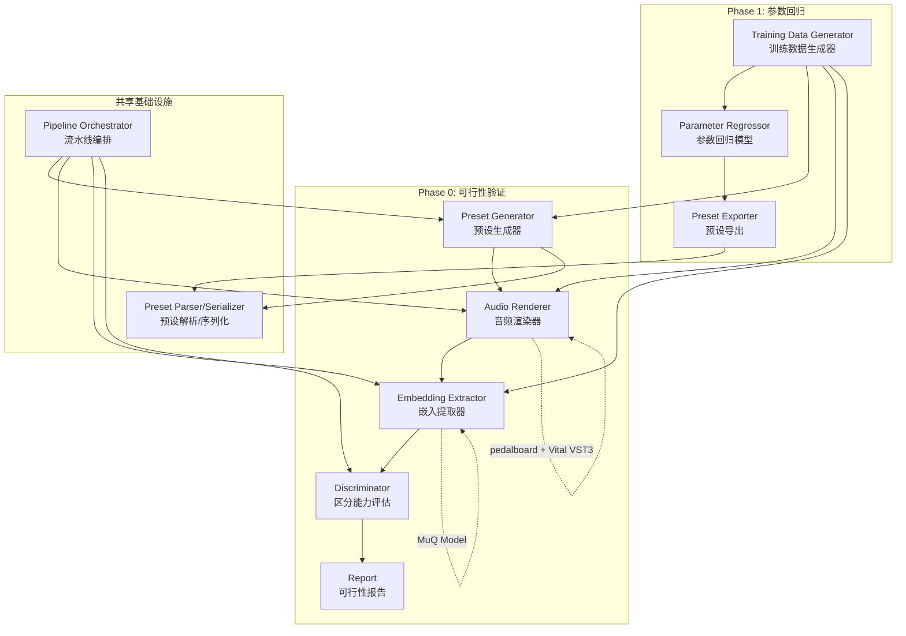
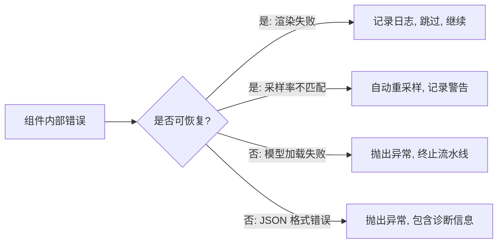

# 设计文档：Vital 合成器参数估计系统

## 概述

本系统旨在从音频信号反向估计 Vital 合成器参数。采用分阶段策略：

- **Phase 0（可行性验证）**：验证 MuQ 音频表征能否区分 Vital 效果器的开关状态。通过生成控制变量预设 → 渲染音频 → 提取 MuQ embedding → 评估区分能力的流水线完成。
- **Phase 1（核心参数回归）**：在 Phase 0 通过后，训练从 MuQ embedding 预测约 45 个核心合成器参数的回归模型。

### 设计决策

1. **音频渲染方案**：Vital 是闭源 VST 插件，没有官方 CLI。选用 `pedalboard`（Spotify 开源的 Python VST host 库）加载 Vital VST3 插件进行离线渲染。理由：
   - 纯 Python API，无需编译 C++ 代码
   - 支持 macOS 上的 VST3/AU 插件加载
   - 可编程控制 MIDI 输入和音频输出
   - 替代方案 RenderMan 需要 JUCE 编译，维护状态不确定

2. **MuQ 集成方式**：直接通过 PyTorch 加载 MuQ 预训练模型，使用其 `MuQMuCodec` 或 feature extractor 接口提取 embedding。MuQ 输出维度为 1024（基于 HuBERT 架构）。

3. **预设操作策略**：基于 JSON 直接操作。Vital 预设本质是 JSON 文件，包含 `settings` 字典（772 个参数键值对）和 `modulations` 列表（64 个调制槽位）。无需第三方库，直接用 Python `json` 模块读写。

4. **实验数据组织**：采用带时间戳的实验目录，每次运行隔离，便于对比和复现。

## 架构

### 系统架构图



### 目录结构

```
synth-parameter-estimation/
├── src/
│   ├── __init__.py
│   ├── preset_generator.py      # 需求1: 预设生成
│   ├── audio_renderer.py        # 需求2: 音频渲染
│   ├── embedding_extractor.py   # 需求3: MuQ embedding 提取
│   ├── discriminator.py         # 需求4: 区分能力评估
│   ├── preset_parser.py         # 需求5: 预设解析与序列化
│   ├── pipeline.py              # 需求6: 流水线编排
│   ├── parameter_regressor.py   # 需求7: 参数回归模型
│   └── training_data.py         # 需求8: 训练数据生成
├── tests/
│   ├── test_preset_generator.py
│   ├── test_preset_parser.py
│   ├── test_discriminator.py
│   └── test_training_data.py
├── scripts/
│   ├── run_phase0.py            # Phase 0 一键运行入口
│   └── analyze_vital_params.py  # 已有的参数分析脚本
├── experiments/                  # 实验产物目录
│   └── {timestamp}/
│       ├── presets/
│       ├── audio/
│       ├── embeddings/
│       └── report.json
└── configs/
    └── default.yaml              # 默认配置
```

## 组件与接口

### 1. PresetParser（预设解析/序列化 - 需求5）

所有其他组件的基础依赖。负责 Vital 预设 JSON 的读写和验证。

```python
@dataclass
class VitalPreset:
    """Vital 预设的结构化表示"""
    settings: dict[str, float | int | str | list]
    modulations: list[dict]
    # 原始 JSON 中的其他顶层键（如 wavetable 数据）
    extra: dict

class PresetParser:
    EFFECT_SWITCHES: list[str] = [
        "chorus_on", "compressor_on", "delay_on", "distortion_on",
        "eq_on", "flanger_on", "phaser_on", "reverb_on", "filter_fx_on"
    ]

    def parse(self, filepath: Path) -> VitalPreset:
        """解析 .vital 文件为 VitalPreset 对象。
        Raises: PresetParseError 如果 JSON 无效或缺少 settings 键。"""

    def serialize(self, preset: VitalPreset, filepath: Path) -> None:
        """将 VitalPreset 序列化为 .vital JSON 文件。"""

    def validate_effect_switches(self, preset: VitalPreset) -> bool:
        """验证预设包含所有 9 个 Effect_Switch 键。"""
```

### 2. PresetGenerator（预设生成 - 需求1）

基于 Base_Patch 生成控制变量预设。

```python
class PresetGenerator:
    def __init__(self, parser: PresetParser, base_patch_template: dict):
        """base_patch_template: 包含所有 772 个参数默认值的字典"""

    def create_base_patch(self) -> VitalPreset:
        """创建 Base_Patch：osc_1_on=1.0, filter_1_on=1.0, 默认波表。"""

    def create_effect_variant(
        self, effect_name: str, state: float
    ) -> VitalPreset:
        """生成仅指定 Effect_Switch 与 Base_Patch 不同的预设。
        Args:
            effect_name: 效果器开关名（如 "chorus_on"）
            state: 0.0（关）或 1.0（开）
        Raises: ValueError 如果 effect_name 不在 EFFECT_SWITCHES 中。"""

    def generate_all_variants(self, output_dir: Path) -> list[Path]:
        """为 9 个效果器各生成开/关预设，共 18 个文件。
        返回生成的文件路径列表。"""
```

### 3. AudioRenderer（音频渲染 - 需求2）

通过 pedalboard 加载 Vital VST3 插件渲染音频。

```python
@dataclass
class RenderConfig:
    midi_note: int = 60          # C4
    velocity: int = 100
    duration_sec: float = 2.0
    sample_rate: int = 44100
    timeout_sec: float = 30.0

@dataclass
class RenderSummary:
    success_count: int
    failure_count: int
    failed_files: list[str]

class AudioRenderer:
    def __init__(self, vital_vst_path: Path, config: RenderConfig):
        """加载 Vital VST3 插件。"""

    def render_preset(self, preset_path: Path, output_path: Path) -> bool:
        """渲染单个预设为 WAV 文件。返回是否成功。"""

    def render_batch(
        self, preset_dir: Path, output_dir: Path
    ) -> RenderSummary:
        """批量渲染目录下所有 .vital 文件。"""
```

### 4. EmbeddingExtractor（MuQ Embedding 提取 - 需求3）

```python
@dataclass
class EmbeddingResult:
    embeddings: dict[str, np.ndarray]  # filename -> embedding vector
    dimension: int                      # embedding 维度

class EmbeddingExtractor:
    def __init__(self, model_path: str | None = None, device: str = "cpu"):
        """加载 MuQ 模型。model_path=None 时使用默认预训练权重。"""

    def extract(self, audio_path: Path) -> np.ndarray:
        """从单个 WAV 文件提取 embedding。
        自动重采样至 MuQ 要求的采样率。"""

    def extract_batch(self, audio_dir: Path) -> EmbeddingResult:
        """批量提取目录下所有 WAV 的 embedding。"""

    def save(self, result: EmbeddingResult, output_path: Path) -> None:
        """保存 embedding 为 .npz 文件（文件名到向量的映射）。"""
```

### 5. Discriminator（区分能力评估 - 需求4）

```python
@dataclass
class EffectDiscriminationResult:
    effect_name: str
    cosine_similarity: float
    classification_accuracy: float
    is_distinguishable: bool       # accuracy >= 0.75
    is_too_similar: bool           # cosine_similarity > 0.99

@dataclass
class FeasibilityReport:
    results: list[EffectDiscriminationResult]
    pass_count: int                # accuracy >= 75% 的效果器数量
    is_feasible: bool              # pass_count >= 6
    recommendation: str

class Discriminator:
    ACCURACY_THRESHOLD: float = 0.75
    SIMILARITY_WARNING: float = 0.99
    MIN_PASS_COUNT: int = 6

    def evaluate_effect(
        self, on_embeddings: np.ndarray, off_embeddings: np.ndarray,
        effect_name: str
    ) -> EffectDiscriminationResult:
        """评估单个效果器的区分能力。"""

    def evaluate_all(
        self, embeddings: EmbeddingResult
    ) -> FeasibilityReport:
        """评估所有 9 个效果器，生成可行性报告。"""
```

### 6. PipelineOrchestrator（流水线编排 - 需求6）

```python
class PipelineStep(Enum):
    GENERATE_PRESETS = "generate_presets"
    RENDER_AUDIO = "render_audio"
    EXTRACT_EMBEDDINGS = "extract_embeddings"
    EVALUATE = "evaluate"

@dataclass
class PipelineResult:
    experiment_dir: Path
    step_timings: dict[str, float]  # step_name -> seconds
    feasibility: FeasibilityReport | None
    error: str | None

class PipelineOrchestrator:
    def run(
        self, output_base: Path, start_from: PipelineStep | None = None
    ) -> PipelineResult:
        """执行完整 Phase 0 流水线。
        start_from: 从指定步骤恢复（跳过已完成步骤）。"""
```

### 7. ParameterRegressor（参数回归 - 需求7）

```python
@dataclass
class RegressionMetrics:
    per_param_mae: dict[str, float]   # param_name -> MAE
    overall_mae: float
    spectral_loss: float              # 多频谱损失

class ParameterRegressor(nn.Module):
    """MLP 回归模型：MuQ embedding → 45 个核心参数"""

    def __init__(self, input_dim: int = 1024, output_dim: int = 45):
        """input_dim: MuQ embedding 维度
        output_dim: 核心参数数量"""

    def forward(self, embedding: torch.Tensor) -> torch.Tensor:
        """预测参数向量。"""

    def export_preset(
        self, predicted_params: torch.Tensor, parser: PresetParser
    ) -> VitalPreset:
        """将预测参数导出为 Vital 预设。"""
```

### 8. TrainingDataGenerator（训练数据生成 - 需求8）

```python
@dataclass
class DatasetMetadata:
    param_ranges: dict[str, tuple[float, float]]  # param -> (min, max)
    param_names: list[str]
    total_samples: int
    split_ratio: tuple[float, float, float]  # train/val/test
    failed_samples: int

class TrainingDataGenerator:
    SPLIT_RATIO = (0.8, 0.1, 0.1)

    def __init__(
        self, generator: PresetGenerator, renderer: AudioRenderer,
        extractor: EmbeddingExtractor
    ):
        pass

    def sample_parameters(self, n: int) -> np.ndarray:
        """在 45 个核心参数的有效值域内均匀随机采样。
        返回 (n, 45) 的参数矩阵。"""

    def generate_dataset(
        self, n_samples: int, output_dir: Path
    ) -> DatasetMetadata:
        """生成完整数据集：采样 → 渲染 → 提取 embedding → 保存。
        输出 HDF5 文件包含 params 和 embeddings 矩阵。"""
```


## 数据模型

### Vital 预设 JSON 结构

Vital 预设文件（`.vital` 扩展名）的顶层结构：

```json
{
  "author": "string",
  "comments": "string",
  "macro1": "string",
  "macro2": "string",
  "macro3": "string",
  "macro4": "string",
  "preset_name": "string",
  "preset_style": "string",
  "settings": {
    "chorus_on": 0.0,
    "compressor_on": 0.0,
    "osc_1_on": 1.0,
    "osc_1_level": 0.707,
    "filter_1_on": 1.0,
    "filter_1_cutoff": 60.0,
    "...": "共 772 个参数键值对",
    "modulations": [
      {
        "source": "env_2",
        "destination": "filter_1_cutoff",
        "line_mapping": { "num_points": 2, "powers": [0.0], "points": [0.0, 0.0, 1.0, 1.0] }
      }
    ],
    "wavetables": ["...波表数据，base64 编码"]
  }
}
```

关键说明：
- `modulations` 和 `wavetables` 嵌套在 `settings` 字典内部
- 所有数值参数以 `float` 存储（包括开关参数 0.0/1.0）
- 调制槽位固定 64 个，未使用的槽位 source/destination 为空字符串

### 9 个效果器开关参数

| 参数名 | 值域 | 说明 |
|--------|------|------|
| `chorus_on` | 0.0 / 1.0 | 合唱效果器 |
| `compressor_on` | 0.0 / 1.0 | 压缩器 |
| `delay_on` | 0.0 / 1.0 | 延迟效果器 |
| `distortion_on` | 0.0 / 1.0 | 失真效果器 |
| `eq_on` | 0.0 / 1.0 | 均衡器 |
| `flanger_on` | 0.0 / 1.0 | 镶边效果器 |
| `phaser_on` | 0.0 / 1.0 | 相位效果器 |
| `reverb_on` | 0.0 / 1.0 | 混响效果器 |
| `filter_fx_on` | 0.0 / 1.0 | 效果器滤波器 |

### Phase 1 核心参数（约 45 个）

| 模块 | 参数 | 数量 |
|------|------|------|
| osc_1 核心 | level, transpose, tune, wave_frame, unison_voices, unison_detune | 6 |
| filter_1 核心 | cutoff, resonance, drive, mix, model, style | 6 |
| env_1 ADSR | attack, decay, sustain, release | 4 |
| 9 个 Effect_Switch | chorus_on, compressor_on, ... | 9 |
| 9 个 dry_wet | chorus_dry_wet, delay_dry_wet, ... | 9 |
| 其他效果器核心参数 | distortion_drive, reverb_decay_time, ... | ~11 |
| **合计** | | **~45** |

### 实验目录结构

```
experiments/
└── 20250715_143022/              # 时间戳
    ├── config.yaml               # 本次实验配置快照
    ├── presets/
    │   ├── base_patch.vital
    │   ├── chorus_on_1.0.vital
    │   ├── chorus_on_0.0.vital
    │   └── ...                   # 共 18 个预设
    ├── audio/
    │   ├── base_patch.wav
    │   ├── chorus_on_1.0.wav
    │   └── ...                   # 对应 WAV 文件
    ├── embeddings/
    │   ├── all_embeddings.npz    # 汇总的 embedding 文件
    │   └── individual/           # 单独的 .npy 文件
    └── report.json               # 可行性评估报告
```

### 训练数据集格式（Phase 1）

使用 HDF5 格式存储：

```
dataset.h5
├── train/
│   ├── params      (N_train, 45)  float32
│   └── embeddings  (N_train, 1024) float32
├── val/
│   ├── params      (N_val, 45)    float32
│   └── embeddings  (N_val, 1024)  float32
├── test/
│   ├── params      (N_test, 45)   float32
│   └── embeddings  (N_test, 1024) float32
└── metadata/
    ├── param_names     list[str]
    ├── param_ranges    (45, 2)    float32  # [min, max]
    └── generation_log  str        # 生成日志
```


## 正确性属性（Correctness Properties）

*正确性属性是一种在系统所有有效执行中都应成立的特征或行为——本质上是关于系统应该做什么的形式化陈述。属性充当了人类可读规范与机器可验证正确性保证之间的桥梁。*

### Property 1: 预设生成结构完整性

*For any* 由 PresetGenerator 生成的预设，其 settings 字典应包含所有 772 个已知参数键，且每个键的值类型为 float。

**Validates: Requirements 1.1**

### Property 2: 效果器变体单一差异

*For any* 效果器开关名（9 个之一）和目标状态（0.0 或 1.0），由 `create_effect_variant` 生成的预设与 Base_Patch 相比，应仅在该效果器开关参数上存在差异，其余所有参数值完全一致。

**Validates: Requirements 1.3, 1.5**

### Property 3: 无效效果器名拒绝

*For any* 不在 9 个已知 Effect_Switch 列表中的字符串，调用 `create_effect_variant` 应抛出 ValueError，且错误信息中包含无效参数名和有效参数列表。

**Validates: Requirements 1.6**

### Property 4: 音频文件名映射

*For any* 预设文件名（以 .vital 结尾），渲染输出的音频文件名应为相同的基础名加 .wav 扩展名。

**Validates: Requirements 2.4**

### Property 5: 渲染摘要计数一致性

*For any* 批量渲染结果（包含若干成功和若干失败），RenderSummary 的 success_count + failure_count 应等于输入预设总数，且 failed_files 列表长度应等于 failure_count。

**Validates: Requirements 2.6**

### Property 6: Embedding 存储 round-trip

*For any* 文件名到 embedding 向量的映射字典，保存为 .npz 文件后重新加载，应得到与原始映射数值等价的结果。

**Validates: Requirements 3.4**

### Property 7: 可行性判定阈值正确性

*For any* 9 个效果器的分类准确率向量，可行性判定结果应等于"准确率 ≥ 0.75 的效果器数量 ≥ 6"。同时，对于任何 cosine similarity > 0.99 的效果器，应被标记为"表征无法区分"。

**Validates: Requirements 4.5, 4.6**

### Property 8: 区分度评估排序与计算

*For any* 两组随机生成的 embedding 向量（模拟开/关状态），Discriminator 计算的 cosine similarity 应在 [-1, 1] 范围内，分类准确率应在 [0, 1] 范围内，且最终结果应按区分度降序排列。

**Validates: Requirements 4.1, 4.2, 4.3**

### Property 9: 预设解析-序列化 round-trip

*For any* 有效的 VitalPreset 对象，执行 serialize → parse 应产生与原始对象等价的结果（settings 字典键值对完全一致，modulations 列表内容一致）。

**Validates: Requirements 5.3**

### Property 10: 无效输入解析拒绝

*For any* 非法 JSON 字符串或缺少 `settings` 键的 JSON 对象，PresetParser.parse 应抛出 PresetParseError，且错误信息包含具体的格式违规描述。

**Validates: Requirements 5.5**

### Property 11: 流水线失败停止

*For any* 流水线步骤序列，当某个步骤抛出异常时，后续步骤不应被执行，且 PipelineResult 应包含失败步骤名称和错误详情。

**Validates: Requirements 6.2**

### Property 12: 流水线恢复执行

*For any* 起始步骤 S，从 S 恢复执行时，S 之前的步骤不应被执行，S 及其后续步骤应按顺序执行。

**Validates: Requirements 6.3**

### Property 13: 回归模型输入输出维度

*For any* 形状为 (batch_size, 1024) 的输入张量，ParameterRegressor 的输出形状应为 (batch_size, 45)，且所有输出值应在 [0, 1] 范围内（归一化参数空间）。

**Validates: Requirements 7.1**

### Property 14: 参数采样值域约束

*For any* 由 TrainingDataGenerator.sample_parameters 生成的参数向量，每个参数值应在其定义的有效值域 [min, max] 范围内。

**Validates: Requirements 7.2, 8.1**

### Property 15: 预测参数导出有效性

*For any* 在有效值域内的 45 维参数向量，export_preset 应生成一个可被 PresetParser 成功解析的有效 Vital 预设。

**Validates: Requirements 7.5**

### Property 16: 数据集划分比例

*For any* 正整数 N（总样本数），按 80/10/10 划分后，train + val + test 应等于 N，且各子集大小与目标比例的偏差不超过 1 个样本。

**Validates: Requirements 8.3**

### Property 17: 数据集存储 round-trip

*For any* 参数矩阵 (N, 45) 和 embedding 矩阵 (N, 1024)，保存为 HDF5 后重新加载，应得到数值等价的矩阵。

**Validates: Requirements 8.4**

### Property 18: 数据集元数据完整性

*For any* 生成的数据集，其元数据应包含所有 45 个参数的名称和值域范围 [min, max]，且 min < max 对所有参数成立。

**Validates: Requirements 8.6**

## 错误处理

### 错误分类

| 错误类型 | 触发条件 | 处理策略 |
|----------|----------|----------|
| `PresetParseError` | JSON 无效或缺少 settings 键 | 抛出异常，包含文件路径和具体违规内容 |
| `InvalidEffectError` | 效果器名不在已知列表中 | 抛出 ValueError，包含无效名和有效列表 |
| `RenderError` | VST 插件渲染失败或超时 | 记录日志，跳过该预设，继续批量处理 |
| `RenderTimeoutError` | 渲染超过 30 秒 | 终止该渲染，记录超时，继续下一个 |
| `ModelLoadError` | MuQ 模型加载失败 | 抛出异常，包含模型路径和失败原因 |
| `AudioFormatError` | 音频采样率不匹配 | 自动重采样，记录警告日志 |
| `PipelineStepError` | 流水线某步骤失败 | 停止后续步骤，记录失败步骤和错误详情 |
| `FeasibilityGateError` | Phase 0 判定不可行 | 阻止 Phase 1 启动，输出建议 |

### 错误传播策略



### 日志策略

- 使用 Python `logging` 模块，按模块命名 logger
- 日志级别：DEBUG（参数详情）、INFO（步骤进度）、WARNING（自动恢复）、ERROR（失败跳过）
- 每次实验的日志保存到实验目录下的 `experiment.log`

## 测试策略

### 双轨测试方法

本项目采用单元测试 + 属性测试的双轨策略：

- **单元测试**：验证具体示例、边界条件和错误处理
- **属性测试**：验证跨所有输入的通用属性

两者互补：单元测试捕获具体 bug，属性测试验证通用正确性。

### 属性测试配置

- **库选择**：`hypothesis`（Python 生态最成熟的属性测试库）
- **最小迭代次数**：每个属性测试至少 100 次迭代
- **标签格式**：每个测试用注释标注对应的设计属性
  - 格式：`# Feature: synth-parameter-estimation, Property {number}: {property_text}`
- **每个正确性属性由单个属性测试实现**

### 测试矩阵

| 属性 | 测试类型 | 测试文件 | 说明 |
|------|----------|----------|------|
| Property 1 | 属性测试 | test_preset_generator.py | 生成随机预设，验证 772 键完整性 |
| Property 2 | 属性测试 | test_preset_generator.py | 随机选择效果器和状态，验证单一差异 |
| Property 3 | 属性测试 | test_preset_generator.py | 生成随机字符串，验证无效名拒绝 |
| Property 4 | 属性测试 | test_audio_renderer.py | 生成随机 .vital 文件名，验证映射 |
| Property 5 | 属性测试 | test_audio_renderer.py | 生成随机成功/失败计数，验证摘要 |
| Property 6 | 属性测试 | test_embedding_extractor.py | 生成随机 embedding 字典，验证 round-trip |
| Property 7 | 属性测试 | test_discriminator.py | 生成随机准确率向量，验证阈值判定 |
| Property 8 | 属性测试 | test_discriminator.py | 生成随机 embedding 对，验证计算和排序 |
| Property 9 | 属性测试 | test_preset_parser.py | 生成随机 VitalPreset，验证 round-trip |
| Property 10 | 属性测试 | test_preset_parser.py | 生成随机无效 JSON，验证错误抛出 |
| Property 11 | 属性测试 | test_pipeline.py | 模拟随机步骤失败，验证停止行为 |
| Property 12 | 属性测试 | test_pipeline.py | 随机选择起始步骤，验证恢复行为 |
| Property 13 | 属性测试 | test_parameter_regressor.py | 生成随机 batch_size，验证输出维度 |
| Property 14 | 属性测试 | test_training_data.py | 验证采样参数在值域内 |
| Property 15 | 属性测试 | test_parameter_regressor.py | 生成随机参数向量，验证导出有效性 |
| Property 16 | 属性测试 | test_training_data.py | 生成随机 N，验证划分比例 |
| Property 17 | 属性测试 | test_training_data.py | 生成随机矩阵，验证 HDF5 round-trip |
| Property 18 | 属性测试 | test_training_data.py | 验证元数据完整性 |

### 单元测试覆盖

单元测试聚焦于属性测试不覆盖的领域：

- **具体示例**：Base_Patch 的 osc_1_on=1.0 和 filter_1_on=1.0（需求 1.2）、18 个预设文件生成（需求 1.4）
- **边界条件**：cosine similarity = 0.99 的边界判定（需求 4.6）、渲染超时处理（需求 2.5）、数据生成中样本失败跳过（需求 8.5）
- **集成测试**：完整 Phase 0 流水线端到端测试（需要 Vital VST 插件可用）、MuQ 模型加载和 embedding 提取（需要模型权重可用）

### 测试依赖隔离

- 音频渲染和 embedding 提取的单元测试使用 mock 对象替代实际的 VST 插件和 MuQ 模型
- 集成测试标记为 `@pytest.mark.integration`，仅在 CI 环境中有相应外部依赖时运行
- 属性测试使用 `hypothesis` 的 `@settings(max_examples=100)` 配置
